<a href="https://lfdiego.xyz">
  <picture>
    <source media="(prefers-color-scheme: dark)" srcset="assets/header-dark.svg">
    
  </picture>
</a>

 

Apprentice software developer (*Fachinformatiker für Anwendungsentwicklung*) at **MediaMarktSaturn**, co-founder of **IT Service Hecker & Göttler**, and the person behind a small pile of Fabric mods for Hypixel SkyBlock. I care about clean, maintainable code and software that gets real work done — not demos.

 

<picture>
  <source media="(prefers-color-scheme: dark)" srcset="assets/work-dark.svg">
  
</picture>

| № | Project | About | Tech |
|:--|:--|:--|--:|
| `01` | **[DiegoAddons V2](https://github.com/DiegoLikesPizza/diegoaddonsv2)** | Client-side Fabric mod for Hypixel SkyBlock — 60 features, a searchable settings menu, in-world dungeon & mining tooling. | `Java` |
| `02` | **[diegos-config-lib](https://github.com/DiegoLikesPizza/diegos-config-lib)** | Annotation-driven config library with a themeable settings GUI and a drag-and-drop HUD editor. | `Java` |
| `03` | **[IT Service Hecker & Göttler](https://it-service-hg.de)** | The company I co-founded — fast, conversion-focused site for small businesses, built end to end. | `Next.js` |
| `04` | **[CUTECAT](https://github.com/DiegoLikesPizza/CUTECAT)** | Java desktop app driving an Arduino rover over HTTP — manual to fully autonomous. Team of six. | `Java` |

 

<picture>
  <source media="(prefers-color-scheme: dark)" srcset="assets/stack-label-dark.svg">
  
</picture>

<picture>
  <source media="(prefers-color-scheme: dark)" srcset="assets/stack-dark.svg">
  
</picture>

  

<picture>
  <source media="(prefers-color-scheme: dark)" srcset="assets/contact-dark.svg">
  
</picture>

**[lfdiego.xyz](https://lfdiego.xyz)** &nbsp;·&nbsp; [dg@lfdiego.xyz](mailto:dg@lfdiego.xyz) &nbsp;·&nbsp; [LinkedIn](https://www.linkedin.com/in/diego-g%C3%B6ttler-25bb0339b)

 

<code>NEAR-MONOCHROME. ONE DROP OF INK.</code>
